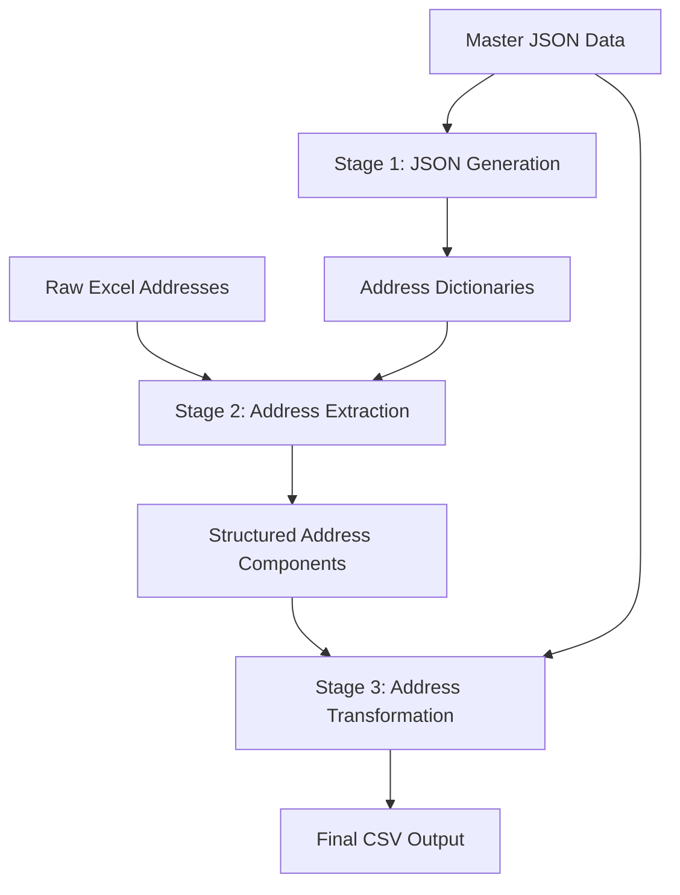

# Vietnamese Address Processing Pipeline

## 🔄 Data Processing Workflow

### Overview

This pipeline processes Vietnamese addresses through three sequential stages: JSON generation, address extraction, and address transformation. Each stage transforms the data format and adds structured information for downstream applications.

---

## 📊 Stage 1: JSON Dictionary Generation

### **Purpose**

Generate hierarchical Vietnamese administrative unit dictionaries from master reference data to support address parsing operations.

### **Input Data**

- **File**: `full_json_generated_data_vn_units.json`
- **Format**: Nested JSON with Vietnamese administrative hierarchy
- **Content**: Provinces, districts, wards with official codes and names

### **Processing Logic**

**Part 1: Automated Dictionary Generation**

1. **Load Master Data**: Parse the master JSON file containing all Vietnamese administrative units
2. **Data Extraction**: Extract relationships between provinces, districts, and wards
3. **Dictionary Generation**: Create separate JSON files for different administrative level combinations:
   - Province-District relationships (`qh/tinh_quan.json`, `qh/tinh_huyen.json`)
   - District-Ward relationships (`px/quan_phuong.json`, `px/huyen_xa.json`)
   - Special city handling for Hanoi and Ho Chi Minh City (`hcmhn/` folder)
4. **Lowercase Conversion**: Normalize all dictionary keys and values to lowercase for consistent matching

**Part 2: LLM-Generated Street Dictionaries (Semi-automatic)**

- **Street Dictionary Generation**: `qh_duong.json` created using Large Language Model (Grok3 + deepresearch mode)
- **Prompt Source**: Processing instructions stored in `promt.txt`
- **Character Normalization**: `chuanhoa.csv` used for standardizing common Vietnamese characters and abbreviations

### **Output Data**

- **Location**: `csdl_dia_chi/generated_json/` directory
- **Structure**: Hierarchical JSON files organized by administrative relationships
- **Files Generated**: 18+ JSON dictionaries for different administrative combinations

### **Key Functions**

- `load_master_json()`: Loads and validates master reference data
- `generate_qh_dictionaries()`: Creates province-district mappings
- `generate_px_dictionaries()`: Creates district-ward mappings
- `process_special_cities()`: Handles Hanoi and HCMC special cases
- `generate_street_dictionaries()`: LLM-assisted street name dictionary creation using prompt templates

---

## 🔍 Stage 2: Address Extraction

### **Purpose**

Parse raw Vietnamese addresses into structured administrative components using rule-based extraction with generated dictionaries.

### **Input Data**

- **File**: `address_full_0712.xlsx`
- **Format**: Excel spreadsheet with raw address column
- **Content**: Unstructured Vietnamese addresses requiring parsing

### **Processing Logic**

1. **Dictionary Loading**: Load all JSON dictionaries from Stage 1
2. **Address Preprocessing**: Clean and normalize input addresses
   - Remove special characters and extra whitespace
   - Standardize Vietnamese diacritics
   - Handle common abbreviations
3. **Entity Recognition**: Identify administrative components using dictionary matching
   - Province (Tỉnh/Thành phố) extraction
   - District (Quận/Huyện/Thị xã) extraction
   - Ward (Phường/Xã/Thị trấn) extraction
   - Street name extraction
4. **Address Reconstruction**: Build normalized address string from extracted components
5. **Quality Validation**: Verify extraction completeness and accuracy

### **Output Data**

- **File**: `extracted_addresses_output.xlsx`
- **Format**: Excel with structured columns
- **Columns**:
  - `Address`: Original raw address
  - `tinh`: Extracted province name
  - `tinh_cat`: Province category (Tỉnh/Thành phố)
  - `qh`: Extracted district name
  - `qh_cat`: District category (Quận/Huyện/Thị xã)
  - `px`: Extracted ward name
  - `px_cat`: Ward category (Phường/Xã/Thị trấn)
  - `duong`: Extracted street name
  - `Address_ch`: Reconstructed standardized address

### **Key Functions**

- `load_address_dict()`: Loads all dictionary files from Stage 1
- `update_entity_address()`: Main extraction engine using rule-based matching
- `normalize_address()`: Text preprocessing and normalization
- `validate_extraction()`: Quality checks for extracted components

---

## 🔄 Stage 3: Address Transformation

### **Purpose**

Transform extracted address components into standardized format with official administrative IDs for database integration.

### **Input Data**

- **File**: `extracted_addresses_output.xlsx` (from Stage 2)
- **Reference**: `full_json_generated_data_vn_units.json` (master administrative data)
- **Format**: Structured address components requiring ID mapping

### **Processing Logic**

1. **Address Combination**: Reconstruct full addresses from extracted components
   full_address = duong + px_cat + px + qh_cat + qh + tinh_cat + tinh
2. **TSV Generation**: Create tsv (text search vector) strings for search indexing
3. **ID Mapping**: Map administrative names to official government codes
   - Province names → Province IDs (2-digit codes)
   - District names → District IDs (3-digit codes)
   - Ward names → Ward IDs (5-digit codes)
4. **Data Standardization**: Ensure consistent formatting and completeness
5. **Output Formatting**: Structure data for target database schema

### **Output Data**

- **File**: `converted_output.csv`
- **Format**: CSV with standardized database schema
- **Columns**:
  - `id`: Sequential record identifier
  - `street_id`: Street identifier (if available)
  - `ward_id`: Official 5-digit ward code
  - `district_id`: Official 3-digit district code
  - `city_id`: Official 2-digit province/city code
  - `country_id`: Country identifier (Vietnam = 1)
  - `full_address`: Complete normalized address string
  - `tsv`: Text serch vector

### **Key Functions**

- `combine_address_strings()`: Reconstructs full addresses from components
- `generate_tsv_column()`: Creates searchable text columns
- `AdminUnitIDMapper`: Maps Vietnamese names to official administrative codes
- `map_row_to_output_format()`: Transforms data to target schema

---

## 🔗 Data Flow Dependencies

### **Critical Dependencies**

1. **Stage 1 → Stage 2**: Generated dictionaries required for address parsing
2. **Stage 2 → Stage 3**: Extracted components required for ID mapping
3. **Master Data**: Required for both Stage 1 (generation) and Stage 3 (mapping)

### **Data Quality Gates**

- **Stage 1**: Validate dictionary completeness and structure
- **Stage 2**: Verify extraction coverage and accuracy rates
- **Stage 3**: Ensure ID mapping success and data completeness

## Notes

### **Data Sources & Quality Considerations**

1. **Address Database Source**

   * Collected from: [vietnamese-provinces-database](https://github.com/ThangLeQuoc/vietnamese-provinces-database.git)
   * maintained community-wise, subject to periodic updates
   * There is no information about street names in the database.
2. **Outdated Administrative Units**: the address file (`address_full_0712.xlsx`) contains legacy district names such as:

   * `"Quận 2"` → now part of **Thành phố Thủ Đức**
   * `"Huyện Từ Liêm"` → split into **Quận Bắc Từ Liêm** and **Quận Nam Từ Liêm**
   * ...
3. **Data Accuracy of Road Mapping (`qh_duong.json`)** : generated with assistance from LLM models; some mappings may be  incomplete or imprecise , especially for

   * Newly formed streets
   * Rare or ambiguous address components
